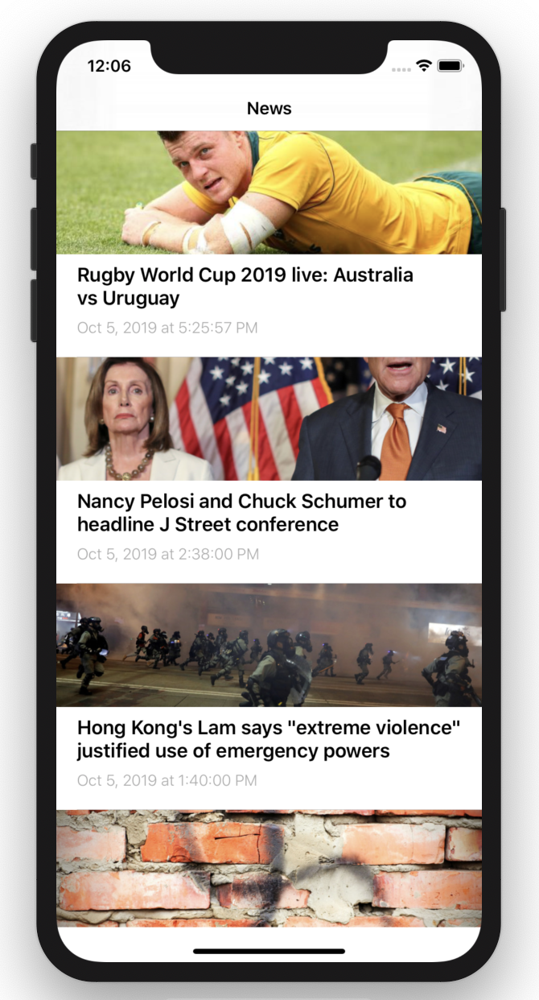
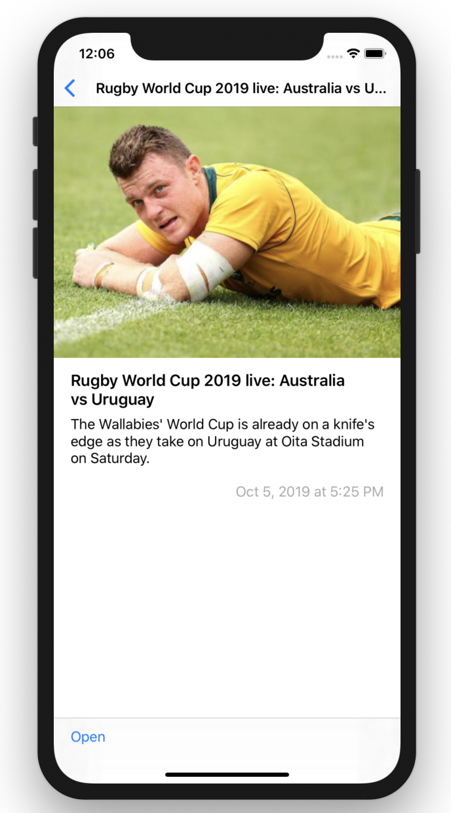
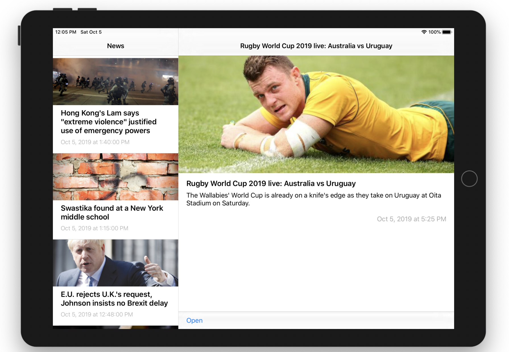
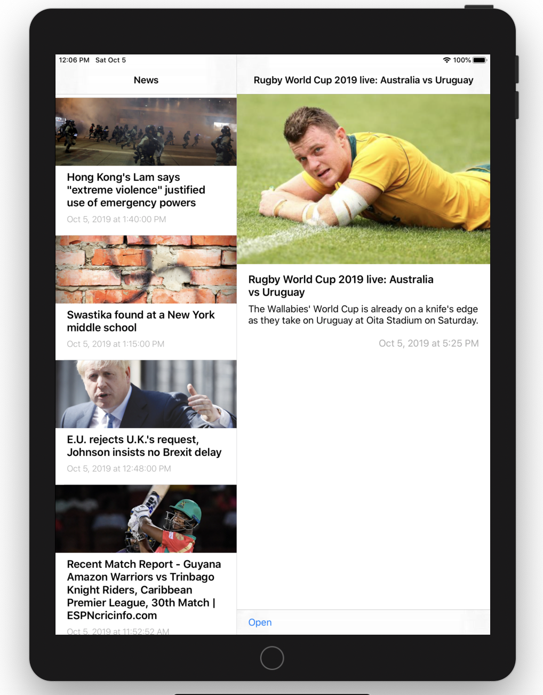
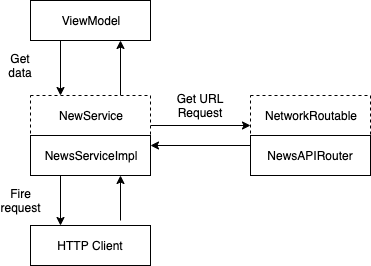

# Overview

The app is a news browser app, it has 2 screens - feed and detail, and uses News API to get news data. This application has been created in education purpose.

|  |  |  |  |
|--|--|--|--|

# Architecture 

The following sections discuss the architecture of different layers of the app

## Networking

Networking module consists of multiple layers stacked together

The deepest layer is `HTTPClient` which has access to `URLSession` which is used to fire requests. `URLSession` here may be swapped with any other network provider, for example, Alamofire. This class has only one generic function which fires the request (`URLRequest`) and returns `Result` with decoded object or error in a callback

The next layer is `Service` (in this case, only `NewsService`), which accesses `HTTPClient` and passes there `URLRequest`. This layer is a high-level interface for any networking client in the app. The service is exposed as protocol so that it can be mocked. It uses `NetworkRoutable` to build an actual URL request

`NetworkRoutable` is the main building block of the URL request. It's a protocol, which defines the interface for endpoint models, and in turn, has a default implementation for `URLRequestConvertible` to provide actual URLRequest. In this case, there's one endpoint model - `NewsAPIRouter`. It is an enum with cases for all the needed API methods. The enum conforms to `NetworkRoutable` and provides all the data needed to build `URLRequest`

All the above can be illustrated with the following diagram:

## Navigation

The app uses coordinator pattern for navigation

A coordinator is an entity which controls the navigation flow in the app. Generally speaking, each distinct linear flow should have a distinct coordinator. Coordinators are then arranged in the hierarchical tree-like order with the root in the `AppCoordinator`, which decides the flow when the app starts. In this case, the app has only one coordinator - `AppCoordinator`

Coordinators conform to `Coordinatable` protocol so that they can be stored as dependencies in other coordinators and have a concise interface. Usually, a coordinator has 2 dependencies - factories for building other coordinators and flow-related views, `CoordinatorFactory` and `ModuleFactory` correspondingly

Coordinators don't access UIKit-specific controller and instead use `NavigationRoutable` to perform actual navigation. It's a protocol, which provides an interface for navigation. In this app it has 2 implementations - `NavigationRouter` and `SplitRouter` for navigation using `UINavigationController` and `UISplitViewController` correspondingly.

All the above can be illustrated with the following diagram:

# Special notes

The architecture used and described above may be seen as overkill for such a small app - there's more boilerplate code than "real" code. However, my assumption is that the code test is used to assess my skills working on a bigger project, where this architecture makes more sense

# Dependencies

I don't use any dependencies here on purpose, as want do make pure solution. But if I wanted, I would use:

1. RxSwift - for binding between view and view models and wrapping network request.
2. Alamofire - for more extensive networking
3. KingFisher - for image downloading
